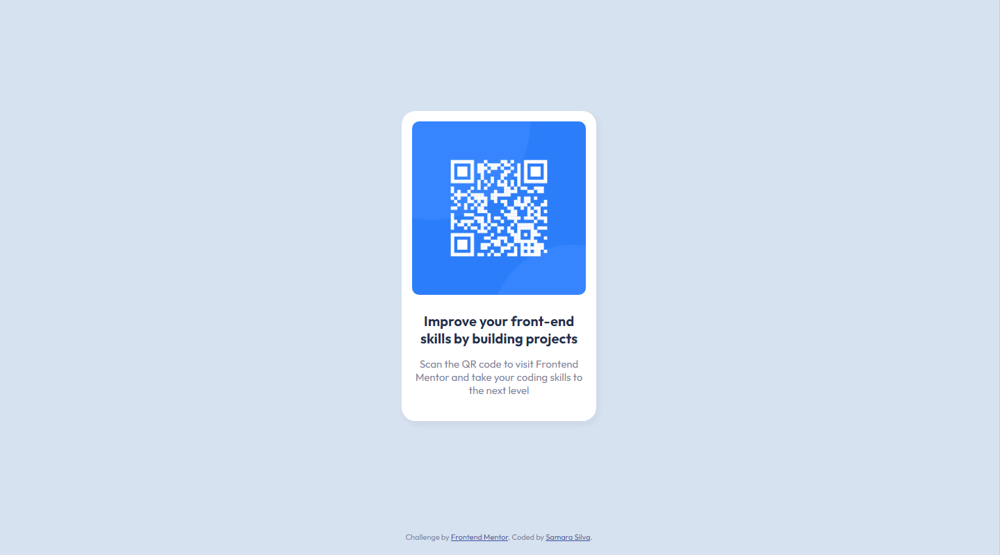

# Frontend Mentor - QR code component solution

This is a solution to the [QR code component challenge on Frontend Mentor](https://www.frontendmentor.io/challenges/qr-code-component-iux_sIO_H). Frontend Mentor challenges help you improve your coding skills by building realistic projects. 

## Table of contents

- [Overview](#overview)
  - [Screenshot](#screenshot)
  - [Links](#links)
- [My process](#my-process)
  - [Built with](#built-with)
  - [What I learned](#what-i-learned)
  - [Continued development](#continued-development)
  - [Useful resources](#useful-resources)
- [Author](#author)
- [Acknowledgments](#acknowledgments)

## Overview

In this README I go over my process of development for this challenge, the things I learned and the tools I used trying to get my page as close to the design as possible.

### Screenshot



### Links

- Solution URL: [](https://www.frontendmentor.io/solutions/qr-code-component-challenge-using-flexbox--fd9CdJ0M3)
- Live Site URL: [](https://samarasilva18.github.io/qr-code-component/)

## My process

1. First I looked through the designs to decide the order in which I was going to structure the parts of the page.
2. I decided to build the div component 'container' first, then the title, the paragraph, and the image. I structured them in HTML.
3. I stylized the HTML components with CSS, going top down. So the container first, then the image, then the title, and then the paragraph.
4. I wrote the README.
5. I created the repository in Github and uploaded the project.

### Built with

- Flexbox

### What I learned

I learned about the property box-shadow in this project! It's a good property for making components in a page really pop. It works with several different values, you can set the X axis, the Y axis, the blur, the spread and the color of the shadow. In the code snippet below I set X and Y axes to 3px and 5px respectively, the blur to 9px and the spread to 2px. I used a very light black as the color. 

```css
.container {
  box-shadow: 3px 5px 9px 2px rgba(0,0,0,.04);
}
```

### Continued development

This was my first Frontend Mentor solution, and I decided to go as simple as possible with it. For future solutions, I'd like to be more daring and try out other frontend technologies that I didn't touch here.

### Useful resources

- [Centering a Div](https://stackoverflow.com/questions/31217268/center-div-on-the-middle-of-screen) - This helped me figure out how to center the component in the middle of the screen!
- [Box-Shadow](https://developer.mozilla.org/en-US/docs/Learn/CSS/Howto/Add_a_shadow) - And this taught me about the box-shadow property, I recommend it for CSS novices.
- [Flexbox](https://css-tricks.com/snippets/css/a-guide-to-flexbox/) - This was helpful for learning about Flexbox! I had already used it in previous projects, but it was clarifying regardless. Highly recommended.

## Author

- Frontend Mentor - [@samarasilva18](https://www.frontendmentor.io/profile/samarasilva18)
- Github - [samarasilva18](https://github.com/samarasilva18)

## Acknowledgments

- Thanks so much to Mohammed Ahmad Hussain (@mah07308) in Front End Mentor for helping me with making the design look good on both mobile and desktop screens!